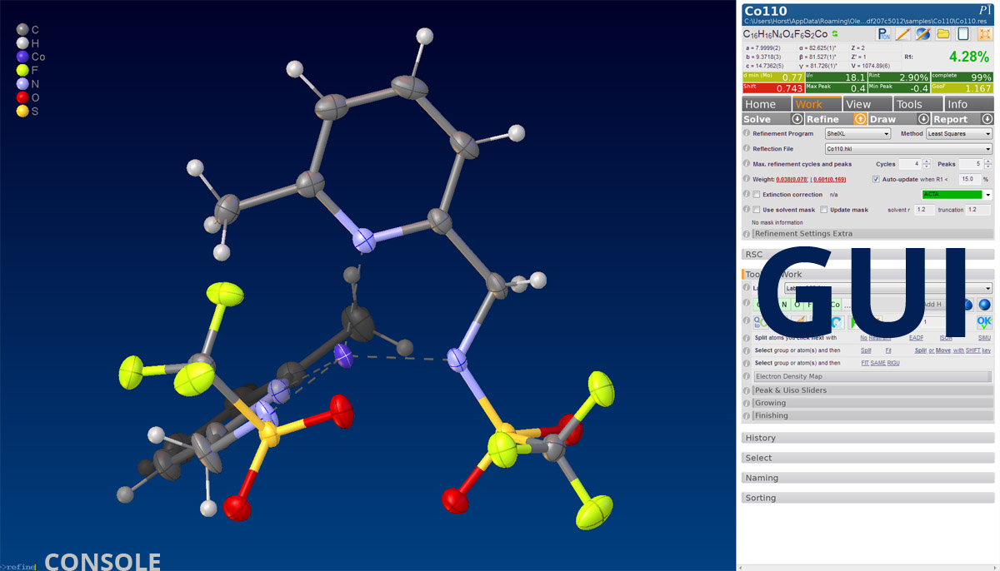

# settings-target
The main settings for Olex2.

# Atom Settings
Some attributes of how atoms are displayed in Olex2 can be modified within a specific style.

## Atom Radius
Change the radius of the selected atoms (in PERS mode). Clicking on 'SET' will make this the default. The atom radius can be set manually with the **arad** and **azoom** commands.

### arad
This parameter affects the radius of the selected (or all, if there is no selection) atoms in *Ball and Stick* (PERS) mode only. Typically, the radius in PERS mode is taken from a definition file (and isn't the same for all elements). **arad** overrides these settings. A typical value for H atoms would be

|`arad 0.2`| Sets the radius of the selected atoms(s) to a value of 0.2 |

### azoom
This *zooms* the displayed atom sizes regardless of whether the atoms are shown in *Ball and Stick* (PERS) or *Ellipsoid* (TELP) modes. This value is given in percent - and scales the selected atoms.

|`azoom 120`| Scales the selected atom(s) to 120 percent |

|`azoom 100`| Scales the selected atom(s) to 100 percent |

100 shows the original atom size; larger/smaller values vary the display accordingly.

Note: This setting can play havoc with the ORTEP '50 PERCENT probability' convention. In order to ensure that all atoms are shown with the standard probability, please use

|`telp 50`| Sets the ADP display to a 50 percent probability level |

 -- and if a different probability is desired, use that, e.g.,

|`telp 30`| Sets the ADP display to a 30 percent probability level |

# Bond Settings

<<<<<<< HEAD
Change the radius of the selected bonds. Clicking on 'SET' will make this the default. Please note that this will change the radius of *all bonds of the same type*. 
=======
## Bond Width
Change the radius of the selected bonds. Clicking on 'SET' will make this the default. Please note that this will change the radius of *all bonds of the same type*.
>>>>>>> 6914cfb79249f3556223f30c3a943aec2952b637

|`individualise`| If you wish to set the radius of a single occurrence of a bond, you must select the bond and type this command first.|

## Style
Choose an overall style setting for all atoms from the dropdown menu.

## Bond Colour
Choose the colour of the bonds here. The default is *elements* -- which means that half the bond will be the colour of one atom and the other half the colour of the other atom. Other options may be chosen from the dropdown menu.

# Background
A choice of different backgrounds is available for Olex2. Depending on the context, sometimes a dark background works better than a light one, and sometimes a graduated background is best. It is easy to switch between them.

## Solid Colour/White
**F2** will toggle between the solid colour background (as defined in the scene settings) and a solid white background.

## Graduated Background
**F4** toggles between the solid background and the graduated background.

| `grad` | Sets the colour of the four corners of the graduated background. Double click in each coloured box to set the color of each corner. |

With **grad -p n.png** you can set a background picture.

# GUI Width
The width of the GUI (by which we mean the panel containing all the commands) can be adjusted to suit your needs. Try the built-in links, but you can also enter any arbitrary value. The font-size of the items on the GUI will also adjust.

## Value < 1

|`panel 0.33`| The GUI width will adjust as a fraction of the screen width **0.33** will divide Olex2 into 2/3 molecule and 1/3 GUI. |

## Value > 100

|`panel 520`| The absolute GUI width in pixels. |

# GUI Side
Set whether the GUI should be on the left or right of the screen

# GUI Links
Set whether some of the links on the GUI are displayed as buttons or as hyperlinks.

# Tooltips
If selected, tooltips will be shown when hovering over items.

# Legend
A pictogram of all current atom types appears in the main window. With the left mouse and the pressed SHIFT key, this can be moved to any position.

| `legend` | Switch the legend on or off. |

# Info Bar

|`showwindow info`| If selected, more information on a structure is shown in the top panel. |

# Reset Alerts
All hidden alerts will be reset.

# Console Lines
In order to avoid too much clutter on the GUI, we have decided to provide the console output behind the molecule. Here you can set the number of lines of output you would like to see. The commands:

|`lines 10`|will set the console to only show 10 lines.|

|`lines -1`|will show all lines.|

# Fader
When ticked, structures will slowly fade in and out.

# Auto Save View
When active, drawing settings such as styles and backgrounds will be saved with the structure. This is somewhat experimental; if things go wrong, you may have to reload the chosen style for that particular structure.

When this option is **not** active, then a structure will be loaded with the same style as the previous structure.

# Start Olex2 In
On startup, Olex2 will go straight to the chosen tab.

# Solo Mode
When opening a new Tool, all other open tools will automatically be closed.

# Close Settings
I'll write some help about this one once I figured out what this is supposed to do.

# Modules Update Notification
If updates to extension modules are availabe, a pop-up box will appear after Olex2 is started. This can be switched off here.

# Unit Cell Style
The unit cell can be displayed in different ways. First, the cell must be visible:

|`cell`| Switches the unit cell display on |

## Cylinder
The unit cell box will be made out of cylinders (i.e. 3-D objects)

## Lines
The unit cell box will be composed of simple Lines.

## Width
This sets the thickness of the cylinders or lines.

## Colour
Right-Click on either the cylinders or lines, then choose **Draw Styles**. For the lines, there is only a single object to set, for the cylinders, the little spheres in the corners as well as the cylinders themselves can be set independently.

# User Database
Olex2 supports a database of people and their institutions. You can set the location of this sqlite database here (a restart is required) and you can also manage your database from here.

# Enable Network
If this box is not ticked, then Olex2 will not communicate with the internet at all, except for checking for updates on startup.

# Debug Mode
This setting is for developers only. Please leave this switch to *off*, unless you know what you are doing.

# PATH
Semicolon-separated strings entered in this box will be added to the **System Path** as new values **before** any existing folders -- this means: any crystallographic software in the folders listed here will be found by Olex2 *first* and therefore will be used. 