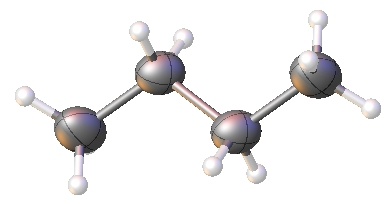

# Shelx Restraints
These are the SHELX restraints. All of these will also apply to a refinement using the olex2.refine.

# DFIX
## DFIX d s[0.02] atom pair(s)
Fixes a distance **d** between pairs of atoms to a given value in &Aring; within an estimated standard deviation of &plusmn; **s** (standard setting 0.02 &Aring;)

Note: DFIX 1.54 0.01 C1 C2 C2 C3 C3 C4

Gives a butane carbon atom chain with bond distances between 1.53 and 1.55 &Aring;. 

# SADI
**SADI s[0.02] atom pairs**  
 
Fixes bond lengths between given atom pairs to a the same distance within an estimated standard deviation of &plusmn; **s** (standard setting 0.02 &Aring;). 
 
**Example:** *SADI 0.005 C1 F1 C1 F2 C1 F3* 
 
Models a CF3 group with same C-F distances within 0.005 &Aring; deviation.